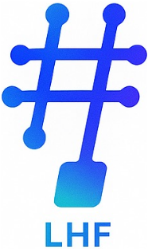

# LearnedHash

LearnedHash is a C++17 learned hashing repository for training learned models,
building scalar learned hash functions, and constructing VortexHash vector
placement functions.

## Components

- `learned_structures/rm_model/`: learned model training, codegen, runtime inference, and shared utilities.
- `hash_functions_core/LEAD/`: scalar learned hash function built on `rm_model`.
- `hash_functions_core/Vortex/`: VortexHash v1 vector training, selector, codegen, and evaluation pipeline.
- `include/faiss/`: trimmed bundled CPU FAISS provider used by Vortex v1 by default.
- `tools/`: command-line utilities for validation, dataset preparation, and benchmarks.
- `docs/public/`: GitHub-facing guides split by workflow.

## Requirements

- CMake 3.16+
- C++17 compiler
- POSIX threads
- OpenMP recommended for FAISS-backed vector paths
- FAISS from the bundled provider, or a system FAISS CMake package exporting
  `faiss` or `faiss::faiss`, for FAISS-backed Vortex training, selector, and
  evaluation paths

## Build And Test

```bash
cmake -S . -B build -DCMAKE_BUILD_TYPE=Release
cmake --build build --config Release
ctest --test-dir build --output-on-failure -j8
```

If you have CMake 3.21 or newer, the repository also provides release presets:

```bash
cmake --preset release-bundled
cmake --build --preset release-bundled
ctest --preset release-bundled
```

Optional build switches:

```bash
# Library-only build, no CLI tools
cmake -S . -B build_lib -DCMAKE_BUILD_TYPE=Release \
  -DLEARNEDHASH_BUILD_TOOLS=OFF

# Lean runtime build, no FAISS-backed Vortex training/selector/eval layer
cmake -S . -B build_lean -DCMAKE_BUILD_TYPE=Release \
  -DLEARNEDHASH_BUILD_TOOLS=OFF \
  -DLEARNEDHASH_BUILD_VORTEX_FAISS_COMPONENTS=OFF

# Use a system FAISS package instead of the bundled provider
cmake -S . -B build_system -DCMAKE_BUILD_TYPE=Release \
  -DLEARNEDHASH_FAISS_PROVIDER=system \
  -DCMAKE_PREFIX_PATH=/path/to/faiss/install
```

FAISS provider modes are `bundled` (default), `system`, and `auto`. The bundled
provider is a CPU-only trim of the FAISS files used by the current build. See
`docs/public/faiss_provider.md` for details and the vendor audit workflow.

## Install And Consume

Install the public libraries, headers, command-line tools enabled in the chosen
build, and CMake package metadata with:

```bash
cmake --install build --prefix /tmp/learnedhash-install
```

Downstream CMake projects can then use the exported package:

```cmake
find_package(LearnedHash CONFIG REQUIRED)
target_link_libraries(your_target PRIVATE LearnedHash::vortex_v1_core)
```

Exported first-party targets are `LearnedHash::rm_model`,
`LearnedHash::lead_core`, `LearnedHash::vortex_v1_runtime`, and
`LearnedHash::vortex_v1_core`. Lean runtime builds export
`LearnedHash::vortex_v1_runtime` but intentionally omit
`LearnedHash::vortex_v1_core` and the FAISS package dependency. When using the
bundled FAISS provider, the install prefix also contains the required FAISS
package metadata.

Verify install/export behavior from an existing build with:

```bash
tools/check_install_export.py --build-dir build
```

If Python was found during CMake configure, the same check is also available as
a build target:

```bash
cmake --build build --target learnedhash_check_install_export
```

For a clean end-to-end readiness check, run:

```bash
tools/check_release_ready.py --jobs 8
```

Add `--report-json /tmp/learnedhash-readiness.json` when you want a
machine-readable timing and evidence summary for the check.

After committing a release candidate, add `--strict-source-archive` to verify
that `git archive HEAD` includes every required source file.

## Primary Tools

The default full build provides rm_model, LEAD, and VortexHash command-line
tools. Library-only builds skip CLI tools, and lean runtime builds also skip
FAISS-backed Vortex training, selector, and evaluation tools. See
`docs/public/tool_reference.md` for runtime, benchmark, validation, compatibility, and
diagnostic tools.

Check CLI help after building:

```bash
build/learned_structures/rm_model/rm_model_learner --help
build/hash_functions_core/LEAD/lead_hashgen --help
build/hash_functions_core/Vortex/vortex_v1_cli --help
build/hash_functions_core/Vortex/vortex_model_selector --help
build/hash_functions_core/Vortex/vortex_model_selector --help-advanced
```

## Logging

Training and selector CLIs share the rm_model logging layer. Set
`LEARNEDHASH_LOG=trace|debug|info|warn|error|off` to adjust verbosity.
`RUST_LOG` is still accepted as a compatibility fallback, but
`LEARNEDHASH_LOG` takes precedence when both are set.

## Quick Starts

Use the public quickstart for a compact build, LEAD smoke, and VortexHash flow:

- `docs/public/quickstart.md`

Component references:

- `learned_structures/rm_model/README.md`
- `hash_functions_core/LEAD/README.md`
- `hash_functions_core/Vortex/README.md`
- `docs/public/vortex_project.md`

## VortexHash Selector And Benchmarks

The Vortex v1 selector searches dataset-aware training configurations and
reports recommendation roles such as `peak_recall`, `knee`, `fast`, and `small`.
Use SIFT-Small only as a test/smoke dataset for fast correctness and pipeline
checks. Use SIFT1M (`--profile sift`) as a reported benchmark dataset for
reported VortexHash quality and runtime numbers.

Dataset provenance is listed in `dataset/SOURCES.md`. The benchmark pack also
has manifest-gated reported benchmark profiles for GIST1M, SIFT10M, DEEP10M-L2, and
SPACEV10M. Raw vector payloads stay under ignored local dataset roots and are
not part of the source package.

```bash
build/hash_functions_core/Vortex/vortex_model_selector \
  --dataset vector_datasets/siftsmall/siftsmall_base.fvecs \
  --nsw vortex_v1_output/siftsmall_nsw.csr \
  --query vector_datasets/siftsmall/siftsmall_query.fvecs \
  --output vortex_v1_output/siftsmall_selector.json
```

Use the benchmark pack before performance or selector-policy changes:

```bash
tools/vortex_sift_benchmark_pack.py \
  --profile siftsmall \
  --preset smoke \
  --build-dir build \
  --skip-build
```

When promoting benchmark numbers into reports, create a portable
artifact bundle from the final scale-validation run:

```bash
tools/vortex_paper_artifact_bundle.py \
  --scale-validation-dir vortex_v1_output/selector_scale_validation/<run> \
  --bundle-name <benchmark-run-name> \
  --copy-reports
```

Public references:

- `docs/public/vortex_model_selector.md`
- `docs/public/vortex_benchmark_pack.md`
- `docs/public/vortex_generated_code_api.md`
- `docs/public/tool_reference.md`

## Data Formats

Scalar datasets use a simple little-endian binary format:

- first 8 bytes: `uint64_t` count;
- payload: `count` items as `uint64_t`, `uint32_t`, or `double`;
- scalar datasets must be sorted in ascending key order.

Vector datasets use standard `.fvecs` / `.ivecs` layout: each vector starts with
a 4-byte dimension followed by the vector payload.

Generated outputs are written under `lead_output/`, `rm_model_output/`, and
`vortex_v1_output/` unless an explicit output directory is provided.

## Validation

Use the readiness check for current validation:

```bash
tools/check_release_ready.py --jobs 8
```

The check covers package boundaries, cleanup safety, FAISS vendor closure,
benchmark/dataset/report schemas, Release build/test modes, and install/export
smoke checks. For focused checks, run:

```bash
tools/check_source_package.py
tools/check_cleanup_local_artifacts.py
tools/audit_faiss_vendor.py
tools/check_install_export.py --build-dir build
```

## Documentation

Public GitHub-facing docs:

- `docs/public/README.md`
- `docs/public/quickstart.md`
- `docs/public/faiss_provider.md`
- `docs/public/vortex_model_selector.md`
- `docs/public/vortex_benchmark_pack.md`
- `docs/public/vortex_generated_code_api.md`
- `docs/public/tool_reference.md`
- component READMEs listed above


## Citation

If you use LearnedHash in research or a published system, please cite:

```bibtex
@INPROCEEDINGS{11192384,
  author={Wang, Shengze and Liu, Yi and Zhang, Xiaoxue and Hu, Liting and Qian, Chen},
  booktitle={2025 IEEE 33rd International Conference on Network Protocols (ICNP)},
  title={A Distributed Learned Hash Table},
  year={2025},
  pages={1-11},
  doi={10.1109/ICNP65844.2025.11192384}
}

@INPROCEEDINGS{10858529,
  author={Wang, Shengze and Liu, Yi and Zhang, Xiaoxue and Hu, Liting and Qian, Chen},
  booktitle={2024 IEEE 32nd International Conference on Network Protocols (ICNP)},
  title={Poster: Distributed Learned Hash Table},
  year={2024},
  pages={1-2},
  doi={10.1109/ICNP61940.2024.10858529}
}

@INPROCEEDINGS{11192399,
  author={Wang, Shengze and Liu, Yi and Qian, Chen},
  booktitle={2025 IEEE 33rd International Conference on Network Protocols (ICNP)},
  title={Poster: Vortex: Efficient Decentralized Vector Overlay for Similarity Search and Delivery},
  year={2025},
  pages={1-3},
  doi={10.1109/ICNP65844.2025.11192399}
}
```

## License

Apache-2.0
